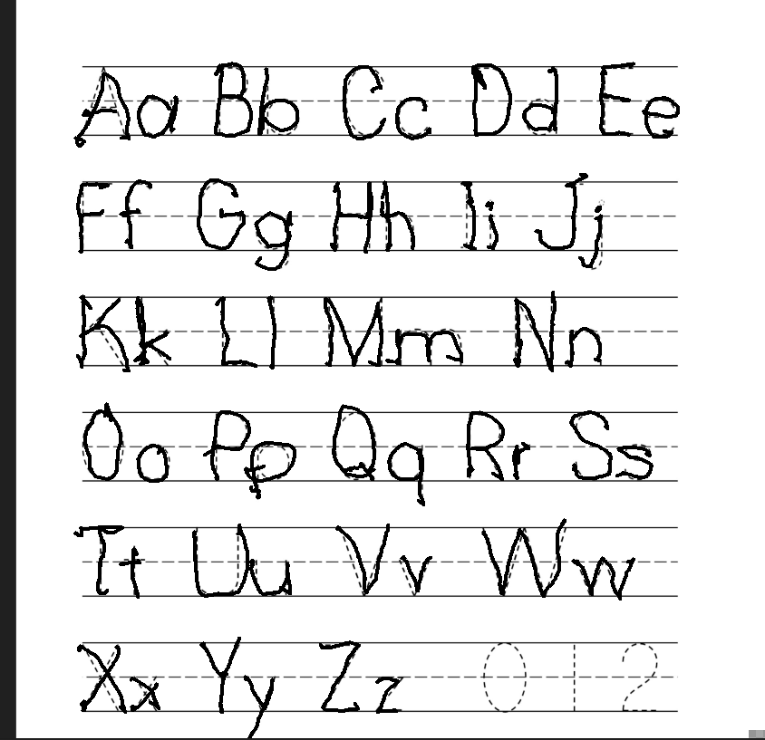

This is the first article in a (hopefully!) series of articles on a new app I'm calling Calli.

### Whiteboarding

Back in February 2024, I found myself in an interesting position. I was spending a lot of time at work mentoring, debating, and doing general design work. This is all cool when everyone is in the office because we can easily share a whiteboard to work through tough ideas. However, since our team is partially in another location and/or not in the office on a given day this ad-hoc whiteboarding couldn't always work. Some friends of mine have adapted to using a whiteboard they stream from a webcam, but that's just... impractical. The solution ended up adopting is to use a Wacom tablet and some whiteboard software so I can just share my screen. This works great, but it exposed me to a _really_ annoying problem: my handwriting is terrible.

You can mostly get away with terrible handwriting on a physical whiteboard with chunky markers, but when using a digital pen with precise drawing the chicken scratch becomes readily apparent. Everything is unreadable, I have no control over the pen (especially the pressure setting!), and I felt bad.

Being bad at handwriting for a person in 2024, especially one that types for a living, is like being bad at throwing a baseball. Like yeah I mean I could if I wanted to, and it would probably be bad, but there's never a time in my life where this is _actually_ a problem. But I needed to be good at handwriting now! Well, maybe not, but it certainly did feel bad trying to explain a concept like green threads to the team and no one was able to understand my writing.

### Doing something about it

Being a fan of [Deliberate Practice](https://a.co/d/9wDZkgV), I decided to try to give a real honest shot at improving my handwriting. Since I was primarily writing using digital pens on digital whiteboards, I felt that the most useful course of action would be to write digitally. This presented some problems though as _every_ _single_ worksheet or course or whatever else for handwriting is designed to be done with real pen and paper. Google was no help as I could not find an app that could help me write better digitally, so I resorted to copy-pasting exercise sheets and notebook paper svgs into paint and then drawing on top of those.

Specimen of my terrible handwriting!

Like all good software engineers with trivial problems, I got tired of this workflow quickly and wondered if I could automate this somehow. I started to wonder if I could make some program that would not just place some text on the screen for me to trace but to grade how well I did and coach me on how to do better.

### Calli

So, now I am writing an app that will do exactly that! I wanted to keep the scope small, as I doubt that I would ever finish it if it was too big. Here are some notes from my initial ideations on how the flow would work:

> The exercise begins by presenting the player with a canvas with the exercise’s current text displayed in the middle of the canvas.

> The player must draw the text and attempt to match the text as best as possible.

> The exercise will automatically detect when a particular character is drawn and grade that character based on how much overdraw and under draw there is.

And here is some of that in action!

<video controls src="/public/calli_first_demo.mp4" title="Video of first working pieces of Calli"></video>

As you can see, the app displays the text to be written and records the user's strokes. It then grades each character for accuracy of shape. I am using 3 canvases (canvi???) here: the first stores the image data that we compare the strokes to, the second displays the outline of the text for tracing, and the third is what the player draws on.

Using the Canvas's [measureText api](https://developer.mozilla.org/en-US/docs/Web/API/CanvasRenderingContext2D/measureText) + the position we draw from, we can create a bounding box around each character. This doesn't work (yet!) for languages with more complicated multi-character graphemes, but for regular English ascii letters, it's just fine.

To grade we simply compare the pixels in canvas 1 (containing the text image data) to canvas 3 (the user's strokes) within each character's bounding box. How well the player did is based on how well matched the pixels without underdrawing or overdrawing. This is calculated as a score of 0..1 for each character. Grading beyond this has not yet been implemented.

I also implemented a large underdraw or overdraw system. This greatly penalizes the player's score if they are missing large parts of the character or drawing mostly outside of it. Of course, this is all configurable, and I hope to make some sort of difficulty system based on these values.

### The Stack

For all the mega nerds out there: Calli is being written with SvelteKit + Typescript? Why? Because it's interesting and fun to me. Why is it interesting? I don't know are you the cops or something?

This may change in the future, but for now, it works well enough. I've thought about writing it in some rust-wasm system, but premature optimization and all that.

You can find Calli on GitHub as it's open source: https://github.com/madxmike/calli
